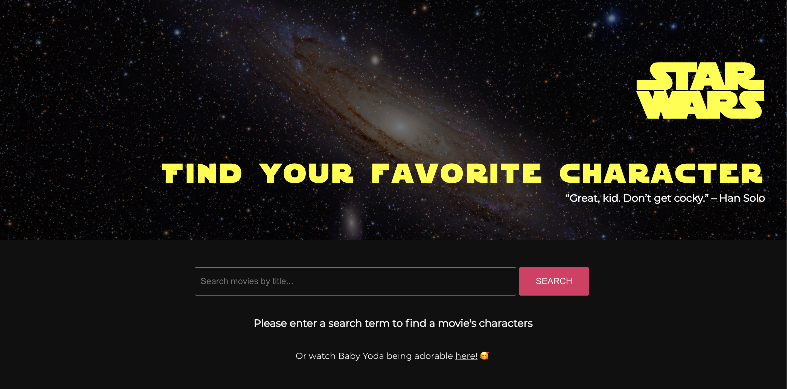

# Star Wars Client

This project was bootstrapped with [Create React App](https://github.com/facebook/create-react-app). It implements the Star Wars Server. The homepage shows a search bar, in which the user can type a query to search the movie title. This will trigger an API request to the server, and a list of movies which are filtered by the query are returned. If no query is entered, all movies will be returned. When a card is clicked, the user is redirected to a detail page, which triggers another API request. This fetches the movie and all its characters. 

## Technical Decisions

At first, one endpoint was created, /search. This fetched all movies, and subsequently fetched all the characters of every movie. This made the app really slow, so it was decided to create two endpoints, one for the list view, and one for the detail page. This significantly improved the speed of the app. 

This change also meant moving the ordering logic to the frontend, to prevent unecessary extra API calls. The set data returned from the Star Wars API is small and not paginated, otherwise ordering should be moved to the backend. 

## Available Scripts

In the project directory, you can run:

### `yarn start or npm start`

Runs the app in the development mode. 
Open [http://localhost:3000](http://localhost:3000) to view it in the browser.

The page will reload if you make edits. 
You will also see any lint errors in the console.

## Future improvements, features and fixes

Since there was limited time to set up this application, I have a few ideas for future improvements:

- Building an error modal, which will appear when a call to the server failed;
- Building a 404 page with a disappointed baby Yoda;
- Implement an http-hook, so prevent code duplication and to keep the application DRY;
- Keep the query and results in cache, so when the user goes back, the original list is shown;
- Make separate .css files for each component to structure the css;
- Make a small database for the images, but not necessary since there is a limited number of films as of now;
- Perhaps use a UI library to make the UI look more slick;
- Write tests;
